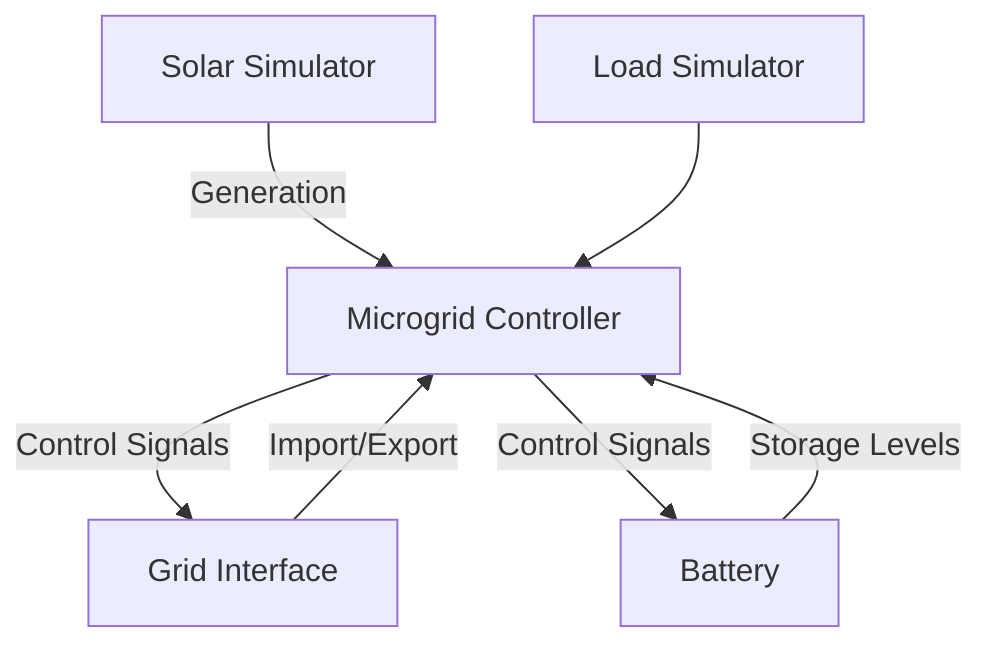

# Grid Energy Simulation Framework

## Overview
Python framework for simulating energy flows in grid-connected microgrid systems with battery storage, solar generation, and dynamic load modeling. Supports real-time simulations with configurable components and time-step energy management.




## Key Components

### Microgrid Controller (`microgrid_simulator.py`)
- Coordinates energy flow between all system components
- Manages simulation time steps and state transitions
- Implements energy balance calculations

```python
class MicroGridSimulator:
    """Core controller for microgrid energy flow simulation"""
    
    def step_state(self, timestep: int) -> None:
        """Advance simulation by one time step"""
        
    def update_state(self, action: float):
        """Adjust system state based on control signals"""
```

### Battery System (`battery_simulator.py`)
- Models lithium-ion battery storage
- Tracks state of charge (SOC) and efficiency losses
- Manages charge/discharge constraints

```python
class BatterySimulator:
    """Lithium-ion battery storage simulation"""
    
    def charge(self, energy: float) -> Tuple[float, float]:
        """Calculate actual charge considering C-rate and efficiency"""
        
    def discharge(self, energy: float) -> Tuple[float, float]:
        """Calculate available discharge energy with SOC limits"""
```

### Grid Interface (`grid_feed_in_simulator.py`)
- Simulates power exchange with main grid
- Implements time-of-use tariff system
- Enforces grid connection limits

```python
class GridFeedInSimulator:
    """Manage grid energy purchase/sellback operations"""
    
    def purchase_energy(self, amount: float) -> Tuple[float, float]:
        """Calculate cost for grid energy purchase"""
```

### Solar Generation (`solar_simulator.py`)
- Models photovoltaic system output
- Generates time-based production forecasts

```python
class SolarSimulator:
    """Photovoltaic generation simulation"""
    
    def setup_solar_generation(self) -> list:
        """Initialize solar production profile"""
```

## Module Reference

### Microgrid Controller (`microgrid_simulator.py`)
- **MicroGridSimulator**: Core coordination of energy components
  - `step`: Advance simulation by one time step
  - `update_state`: Fetch the state for the current timestep
  - `get_current_state`: Fetches the current state. 
  - `balance_energy`: Main logic function. Adjust the system state based on control signals and ensure energy balance. 
  - `artificial_positive_energy_balance`: Runs when the energy balance + the purchase request is positive. Determines how much of the purchase request can be fulfilled.
  - `negative_energy_balance`: Runs when the Energy balance is negative. Decicdes where the energy should come from.
  - `positive_energy_balance`: Runs when the energy balance is positive, determines if any extra energy has been requested to charge the battery
  - `calculate_to_purchase`: Implements logic flow to determine the energy balance and check how much energy should be purchased.
  - `balance_with_battery`: Charges or Discharges the battery to meet need of energy_balance_with_grid.

### Battery System (`battery_simulator.py`)
- **BatterySimulator**: Lithium-ion storage management
  - `charge`: Charges the battery with charge_energy. Implements: Max Charge rate, Battery Efficiency, Max capacity. 
  - `discharge`: Discharges energy from the battery to meet the needs of discharge_energy. Implements: Max discharge rate (C-rate), Battery Efficiency, Min SOC.
  - `update_soc`: Updates the battery's SOC. 
  - `get_charge_capacity`: Get the amount of energy that can go into the battery. Note that the amount of energy used would be energy_in/battery_efficiency
  - `get_discharge_capacity`: Get the amount of energy the battery can discharge. Not that the amount usable energy would by discharge_capacity*battery_efficiency
  - `get_battery_energy`: Get the amount of energy stored in the battery.
  - `get_soc`: Gets the current soc

### Grid Interface (`grid_feed_in_simulator.py`)
- **GridFeedInSimulator**: Power exchange management
  - `purchase_energy`:  Purchase energy from the grid, return the amount purchased and the cost.
  - `calculate_cost`: Calculate the cost of energy purchased. 
  - `setup_tariff_structure`: Initialize time-based pricing model
  - `get_current_tariff`: Get the current cost of energy.

### Solar Generation (`solar_simulator.py`)
- **SolarSimulator**: Photovoltaic output modeling
  - `setup_solar_generation`: Initialize production profile.
  - `get_current_solar_generation`: Get the value of solar production for the current timestep.

### Load Simulation (`load_simulator.py`)
- **LoadSimulator**: Energy demand modeling
  - `setup_loads`: Loads the load data from csv. 
  - `get_current_load`: Get the current load

### Generator Simulation (`generator_simulator.py`)
- **GeneratorSimulator**: Model a backup generator.
  - `setup_generators`: set the capacity and specs of the generator.
  - `run_generators`: Generates the requested amount of energy and calculates the cost.

## Installation
```bash
```

## CLI Usage
```bash

```

## Work Remaining

- **Data Validation**: Add input schema validation for CSV files

- **Documentation**: 
  - 
  -

## License
MIT License
