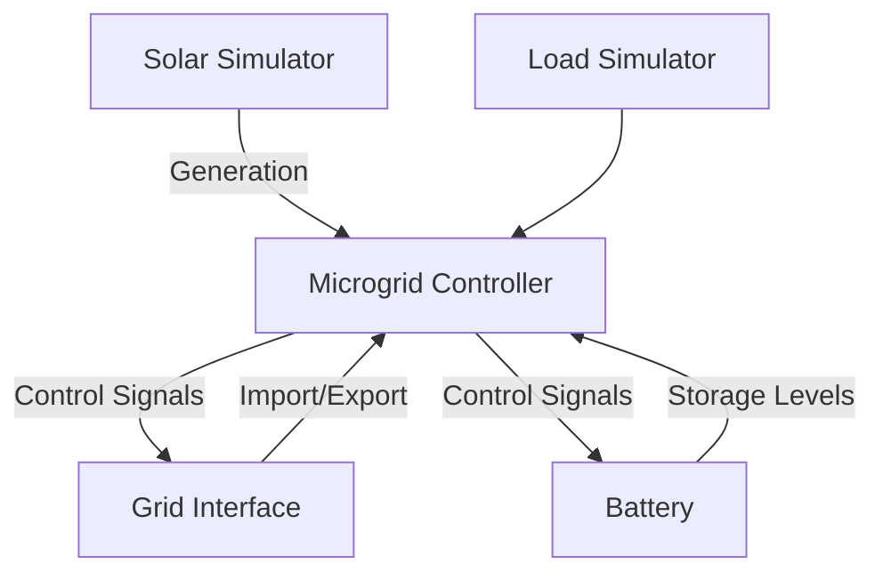

# Grid Energy Simulation Framework

## Overview
Python framework for simulating energy flows in grid-connected microgrid systems with battery storage, solar generation, and dynamic load modeling. Supports real-time simulations with configurable components and time-step energy management.




## Key Components

### Microgrid Controller (`microgrid_simulator.py`)
- Coordinates energy flow between all system components
- Manages simulation time steps and state transitions
- Implements energy balance calculations

```python
class MicroGridSimulator:
    """Core controller for microgrid energy flow simulation"""
    
    def step_state(self, timestep: int) -> None:
        """Advance simulation by one time step"""
        
    def update_state(self, action: float):
        """Adjust system state based on control signals"""
```

### Battery System (`battery_simulator.py`)
- Models lithium-ion battery storage
- Tracks state of charge (SOC) and efficiency losses
- Manages charge/discharge constraints

```python
class BatterySimulator:
    """Lithium-ion battery storage simulation"""
    
    def charge(self, energy: float) -> Tuple[float, float]:
        """Calculate actual charge considering C-rate and efficiency"""
        
    def discharge(self, energy: float) -> Tuple[float, float]:
        """Calculate available discharge energy with SOC limits"""
```

### Grid Interface (`grid_feed_in_simulator.py`)
- Simulates power exchange with main grid
- Implements time-of-use tariff system
- Enforces grid connection limits

```python
class GridFeedInSimulator:
    """Manage grid energy purchase/sellback operations"""
    
    def purchase_energy(self, amount: float) -> Tuple[float, float]:
        """Calculate cost for grid energy purchase"""
```

### Solar Generation (`solar_simulator.py`)
- Models photovoltaic system output
- Generates time-based production forecasts

```python
class SolarSimulator:
    """Photovoltaic generation simulation"""
    
    def setup_solar_generation(self) -> list:
        """Initialize solar production profile"""
```

## Module Reference

### Microgrid Controller (`microgrid_simulator.py`)
- **MicroGridSimulator**: Core coordination of energy components
  - `step_state`: Advance simulation by one time step
  - `update_state`: Adjust system state based on control signals
  - `artificial_positive_energy_balance`: Simulate forced energy surplus scenarios
  - `negative_energy_balance`: Handle energy deficit conditions
  - `positive_energy_balance`: Manage energy surplus distribution

### Battery System (`battery_simulator.py`)
- **BatterySimulator**: Lithium-ion storage management
  - `charge`: Calculate actual charge considering C-rate limits
  - `discharge`: Determine available discharge energy with SOC constraints
  - `get_charge_capacity`: Query maximum charge rate
  - `get_discharge_capacity`: Query maximum discharge rate

### Grid Interface (`grid_feed_in_simulator.py`)
- **GridFeedInSimulator**: Power exchange management
  - `purchase_energy`: Calculate grid energy acquisition costs
  - `setup_tariff_structure`: Initialize time-based pricing model
  - `get_tariff_forecast`: Retrieve tariff rate predictions

### Solar Generation (`solar_simulator.py`)
- **SolarSimulator**: Photovoltaic output modeling
  - `setup_solar_generation`: Initialize production profile

### Load Simulation (`load_simulator.py`)
- **LoadSimulator**: Energy demand modeling
  - `setup_loads`: Configure consumption profiles

## Installation
```bash
git clone https://github.com/Julian-Banks/grid-simulator
pip install -r requirements.txt
```

## CLI Usage
```bash
# Run simulation with default parameters
python -m grid_simulator.microgrid_simulator --steps 1440

# Generate solar forecast report
python -m grid_simulator.solar_simulator --output forecast.csv
```

## Work Remaining
- **GUI Development**: Basic CLI implemented, web interface needed
- **Data Validation**: Add input schema validation for CSV files
- **Error Handling**: Missing exception handling for grid connection failures
- **Documentation**: 
  - Complete parameter descriptions in docstrings
  - Add module-level documentation
- **Testing**:
  - Expand test coverage for edge cases
  - Add integration tests

## License
MIT License
