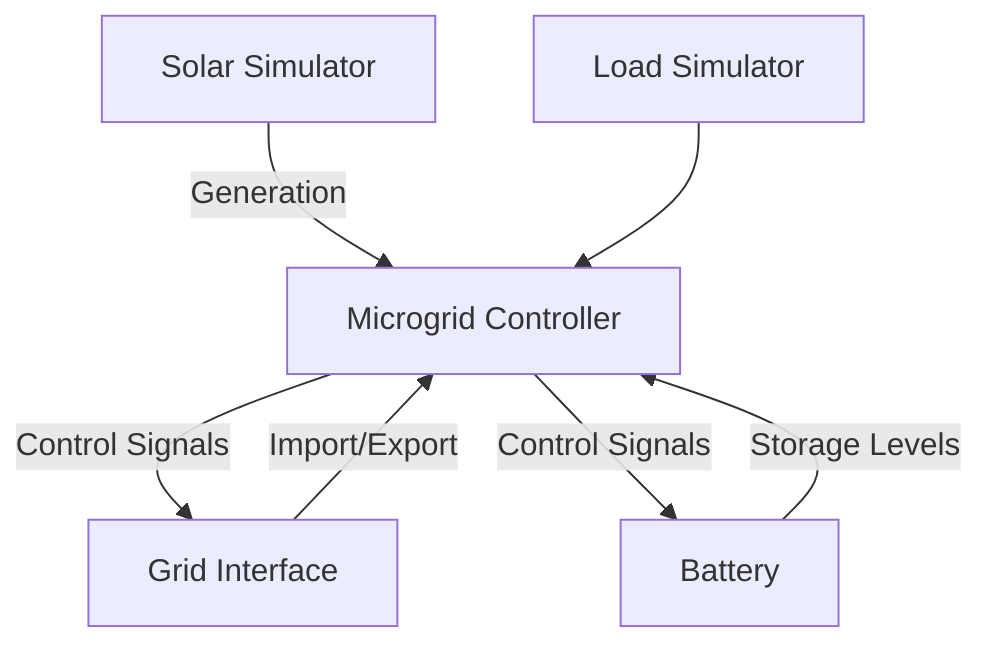

# Grid Energy Simulation Framework

## Overview
Python framework for simulating grid-connected microgrid systems with battery storage, solar generation, and load demand modelling.

## Architecture

## Core Components
### Battery System (battery_simulator.py)
Tracks state of charge (SOC)
Manages charge/discharge rates
Handles efficiency calculations

Configuration:

BatterySimulator(
    battery_capacity=10.0,  # kWh capacity
    battery_C_rate=0.2,      # Charge/discharge rate
    efficiency=0.92,        # Round-trip efficiency
    soc_cutoff=0.3          # Minimum SOC threshold
)

### Grid Interface (grid_feed_in_simulator.py)
Manages grid energy exchange
Implements time-of-use tariffs
Enforces power limits

### Solar Generation (solar_simulator.py)

### Energy Usage (load_simulator.py)

### Microgrid Controller (microgrid_simulator.py)

## Installation
git clone https://github.com/Julian-Banks/grid-simulator
-Need to update requirements.txt

## Testing (to be pipelined)
Run all tests:

**Data Requirements**
CSV format with columns:
timestamp (datetime)
solar_generation (kW)
load_demand (kW)
tariff_rate (currency/kWh)

### License
MIT License

